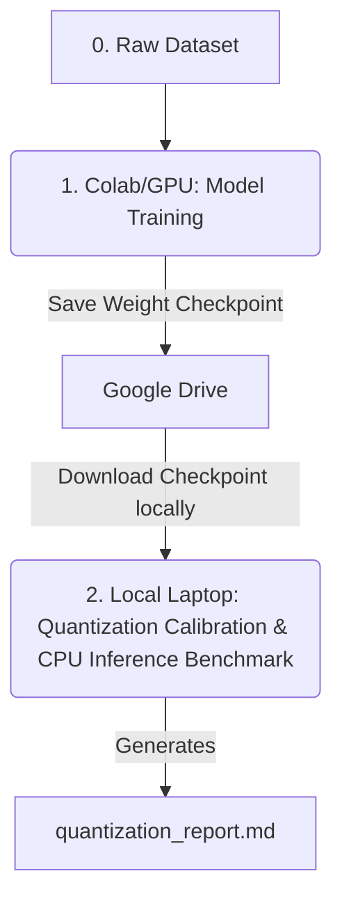

# Fruit Ripeness Ranking: Transfer Learning & CPU Quantization Benchmark

This repository is a reproducible research and benchmarking sandbox designed to optimize **fruit ripeness classification models** using **Transfer Learning** and **Post-Training Static Quantization (PTSQ)** for CPU-bound inference.

---

## 🚀 Workflow Overview

The project uses a hybrid **Colab-to-Local** workflow:



1. **Model Training (Google Colab / GPU)**:
   - Train a quantizable classification model (e.g. ResNet18) on your dataset using GPU acceleration.
   - Save the model weights checkpoint (e.g. `fruit_model.pth`) and download it to your local machine.
2. **Quantization & Benchmarking (Local / CPU)**:
   - Perform Post-Training Static Quantization (PTSQ) using local representative calibration images on CPU.
   - Benchmark model size, evaluation accuracy, and CPU inference latency between the float32 and int8 checkpoints.
   - Generate an automated performance report (`quantization_report.md`).

---

## 📁 Repository Structure

```
├── config/
│   └── config.yaml            # Optional pipeline configuration
├── data/
│   ├── Train/                 # Training set (used locally for quantization calibration)
│   │   ├── Overripe/
│   │   ├── Ripe/
│   │   └── Unripe/
│   └── Test/                  # Test set (used for CPU benchmarking)
│       ├── Overripe/
│       ├── Ripe/
│       └── Unripe/
├── models/                    # Directory where model weights are stored (ignored by git)
│   ├── fruit_model.pth        # Float32 model checkpoint downloaded from Colab
│   └── fruit_model_quantized.pth # Quantized INT8 model state dict (generated locally)
├── src/
│   ├── __init__.py
│   └── models/
│       ├── __init__.py
│       └── quantize.py        # Model definition, dataloaders, PTSQ quantization, & CPU benchmarking
├── main.py                    # Entrypoint CLI for quantization and benchmarking
├── pyproject.toml             # Configuration & package dependencies
└── requirements.txt           # Standard pip requirements file
```

---

## 🛠️ Setup & Installation

### 1. Requirements
Ensure you have Python **>= 3.13** installed. The environment uses PyTorch, Torchvision, and utility libraries.

### 2. Installation using `uv` (Recommended)
This project is configured with `uv` for high-speed package management:
```bash
# Sync dependencies and activate virtual environment
uv sync
source .venv/bin/activate
```

### 3. Installation using standard `pip`
Alternatively, create a virtual environment and install standard dependencies:
```bash
python3 -m venv .venv
source .venv/bin/activate
pip install -r requirements.txt
```

---

## 🏃 Replication Guide

Follow these steps to replicate the experiment:

### Step 1: Place Your Model Checkpoint
Place your trained float32 model checkpoint (state dictionary saved from your Colab training run) in a `models/` directory:
```bash
mkdir -p models
# Move your downloaded weight file here:
# models/fruit_model.pth
```

### Step 2: Run the Quantization and Benchmarking Pipeline
To run static quantization, save the quantized model, and benchmark performance metrics on CPU:
```bash
python main.py --run-all models/fruit_model.pth
```
This single command will:
1. Load your Float32 model.
2. Calibrate activations on a representative subset of the training set.
3. Convert weights and activations to INT8 precision.
4. Save the quantized state dict to `models/fruit_model_quantized.pth`.
5. Benchmark size, accuracy, and latency, and write a summary table to `quantization_report.md`.

### Alternative CLI Command Commands

* **Quantize Only**:
  ```bash
  python main.py --quantize models/fruit_model.pth --out-quantized models/fruit_model_quantized.pth
  ```

* **Benchmark Only**:
  ```bash
  python main.py --benchmark models/fruit_model.pth models/fruit_model_quantized.pth
  ```

---

## 🔬 Quantization Theory

### What is Post-Training Static Quantization (PTSQ)?
In neural networks, weights and activations are typically represented as 32-bit floating-point numbers (`float32`). Post-Training Static Quantization maps these values to 8-bit integers (`int8`), which:
- Reduces memory bandwidth and model file storage by **~4x**.
- Speeds up computation on CPUs by leveraging INT8 hardware matrix multiplication operations.

Static quantization requires a **calibration phase** where representative input samples are run through the model. This allows PyTorch's quantization engine to compute scale and zero-point parameters for activations using the formula:

$$q = \text{round}\left(\frac{x}{\text{scale}}\right) + \text{zero\_point}$$

### Module Fusing
Before quantization, contiguous layers like `Conv2d` -> `BatchNorm2d` -> `ReLU` are fused together into single execution blocks. This eliminates intermediate activation memory transfers, further speeding up CPU latency. Fusing is handled automatically in our pipeline by calling:
```python
model.model.fuse_model()
```
